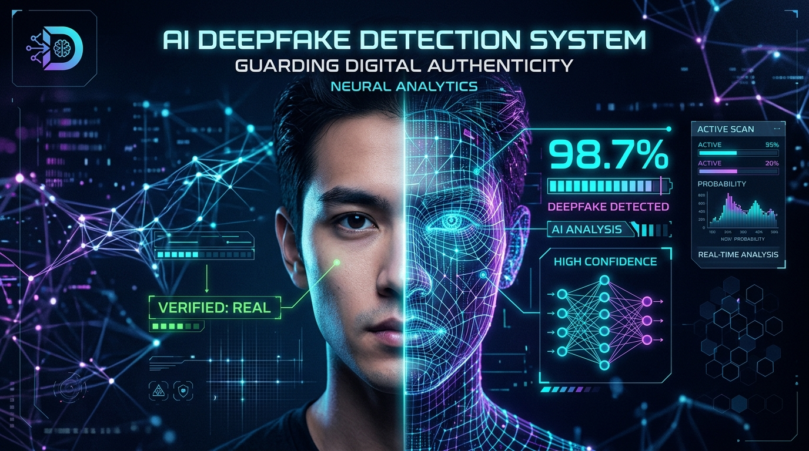
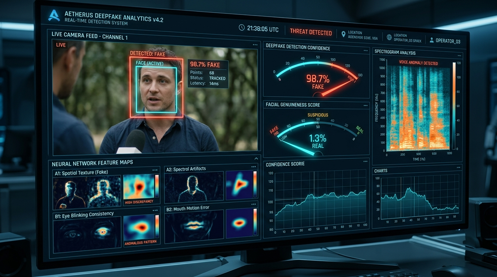

# 🛡️ AI Deepfake Detection System



[](https://www.python.org/)
[](https://pytorch.org/)
[](https://gradio.app/)
[](https://opencv.org/)
[](LICENSE)

An advanced deep learning framework for **real-time and video-based Deepfake Detection**. Powered by **PyTorch** and **EfficientNet-B0**, this repository provides high-accuracy facial manipulation detection across video inputs and live camera streams.

---

## 🌟 Features

- 🎥 **Real-time Live Detection**: Run frame-by-frame deepfake analysis directly on your webcam feed via OpenCV (`detect.py`).
- 🌐 **Gradio Web Application**: User-friendly web UI for dragging and dropping video clips for instant classification (`app.py`).
- 🧠 **EfficientNet-B0 Backbone**: Pre-trained transfer learning architecture fine-tuned for facial manipulation artifact detection.
- ⚡ **GPU-Accelerated**: Automatic CUDA detection with fallback to CPU execution.
- 📊 **Confidence-Based Output**: Instant binary decision (*Real* vs *Fake*) with probability distribution.

---

## 🖥️ Demo & User Interface




---

## 🚀 Quick Start Guide

### 1. Prerequisites & Installation

Ensure you have Python 3.8+ installed. Clone the repository and install required dependencies:

```bash
git clone https://github.com/roshanimahale123/deepfake.git
cd deepfake
pip install -r requirements.txt
```

### 2. Dependencies (`requirements.txt`)

- `torch` & `torchvision` (Deep learning framework & pre-trained models)
- `gradio` (Interactive web UI framework)
- `opencv-python` (Real-time video frame extraction & rendering)
- `pillow` (Image processing)

---

## 💻 Usage

### 🌐 Option A: Launch Web Interface (Gradio)

To start the browser-based web application:

```bash
python app.py
```
Open the provided local URL (e.g. `http://127.0.0.1:7860`) in your browser to upload videos and analyze deepfakes.

### 🎥 Option B: Launch Live Webcam Detection

To analyze live video streams from your primary webcam:

```bash
python detect.py
```
- Press **'q'** to safely close the detection window.

---

## 🏗️ Architecture & Model Details

The model utilizes **EfficientNet-B0** pre-trained on ImageNet as a feature extractor. The classification head is customized with a fully connected layer outputting softmax probabilities across 2 classes:

```
[Input Frame / Video] ➡️ [Resize (224x224) & Normalization]
                             ⬇️
                    [EfficientNet-B0 Backbone]
                             ⬇️
                    [Linear Classifier Head]
                             ⬇️
                  [Softmax Probability (Real / Fake)]
```

Weights are loaded from `deepfake_model.pth`.

---

## 📁 Repository Structure

```
deepfake/
├── assets/
│   ├── deepfake_banner.jpg      # Banner image for README
│   └── deepfake_demo.jpg        # Demo screenshot for README
├── app.py                       # Gradio web application script
├── detect.py                    # Real-time OpenCV webcam detector
├── deepfake_model.pth           # Trained PyTorch model weights file
├── requirements.txt             # Required Python dependencies
├── .gitignore                   # Git ignore settings
└── README.md                    # Project documentation
```

---

## 🤝 Contributing

Contributions, issues, and feature requests are welcome! Feel free to check out the [issues page](../../issues).

---

## 📄 License

This project is licensed under the [MIT License](LICENSE).
